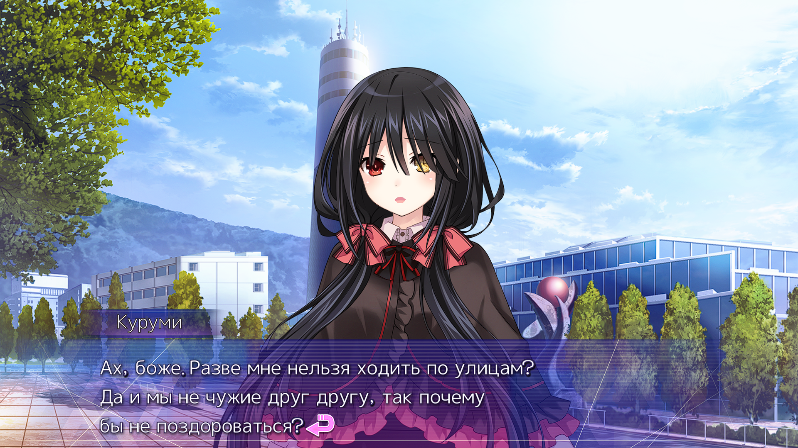
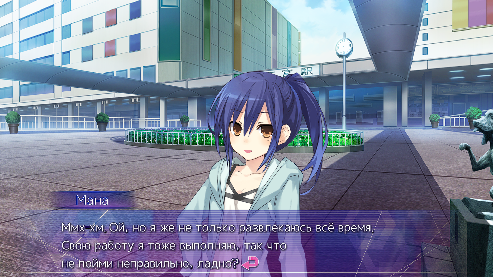
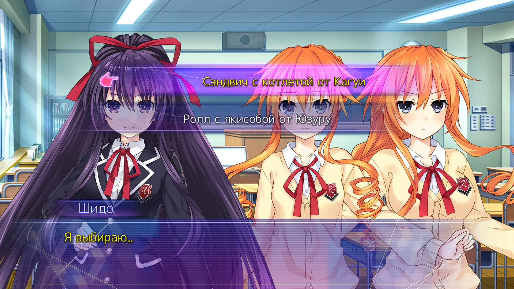
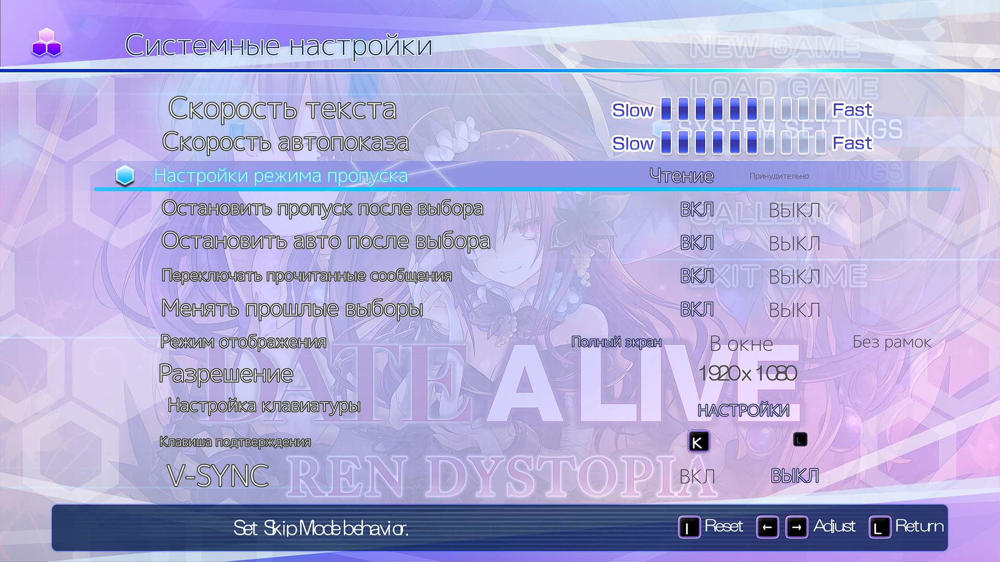
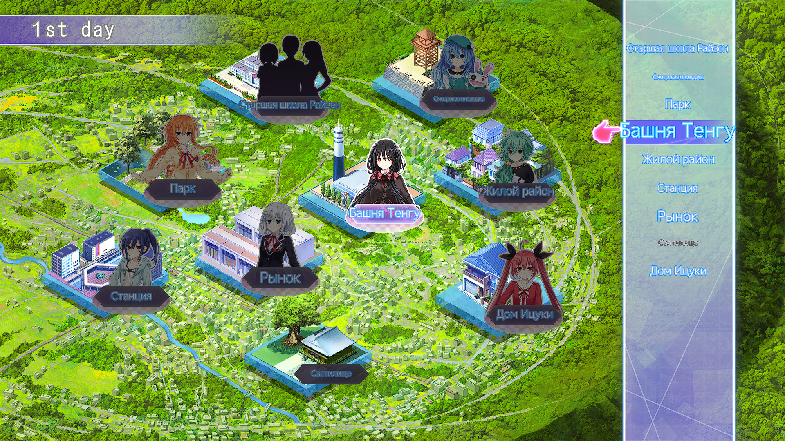

# 🌸 Date A Live: Ren Dystopia — Русификатор 🌸

### Полный перевод новеллы на русский язык

Диалоги · Интерфейс · Настройки · Локации · Имена персонажей

 

 

## ✨ О русификаторе

Этот русификатор переводит **Date A Live: Ren Dystopia** с сохранением стиля и атмосферы оригинала. Диалоги звучат живо и естественно — никакого сухого «гугл-перевода»: сохранены характеры героинь, их манера речи и эмоции, а интерфейс, системные настройки и карта локаций полностью адаптированы под русскоязычного игрока за исключением главного меню, с ним были небольшие проблемы.

Ниже — как это выглядит в игре.

 

---

 

## 💬 Диалоги персонажей

Перевод старались сделать хорошим, без сухости, топорности и нудности гугл перевода

 

  
<b>Для примера</b> — так выглядит диалог с Куруми

 

  
<b>Диалог с Маной</b> — непринуждённый, живой разговорный тон без канцеляризмов

 

---

 

## 💕 Система выборов (руты)

Все варианты ответов и развилки сюжета переведены так, чтобы выбор всегда был понятен — никакой двусмысленности при принятии решений.

 

  
<i>Выбор пути влияет на отношения с героинями — и теперь он полностью на русском</i>

 

---

 

## ⚙️ Локализованные настройки

Системное меню переведено полностью: скорость текста, режимы пропуска и автопоказа, разрешение экрана и управление — всё на русском языке, без потери функциональности оригинала.

 

  
<i>Полный доступ ко всем настройкам игры на родном языке</i>

 

---

 

## 🗾 Карта локаций

Карта города переведена вместе со всеми точками интереса — школа, парк, станция, рынок, святилище и другие локации теперь подписаны на русском.

 

  
<i>Удобная навигация по городу без необходимости распознавать японские названия</i>

 

---

 

## 📦 Установка

1. Скачайте архив русификатора из раздела [Releases](https://github.com/aikoriss/Date-A-Live-Ren-Dystopia-RU/releases)
2. Скопируйте папку и ехе файл руссификатора и вставьте в папку с игрой или запустите установщик и укажите путь к папке с игрой
3. Дождитесь завершения установки
4. Запустите игру — текст уже будет на русском

 

## 💌 Обратная связь

Нашли опечатку, неточность перевода или баг в установщике? Создайте [issue](https://github.com/aikoriss/Date-A-Live-Ren-Dystopia-RU/issues) — любая обратная связь помогает сделать перевод лучше.

 

---

Сделано с ❤️ для русскоязычного комьюнити Date A Live

